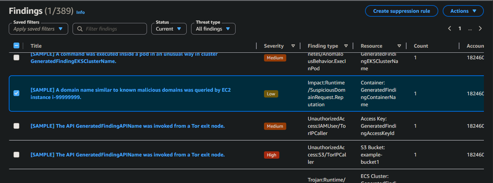
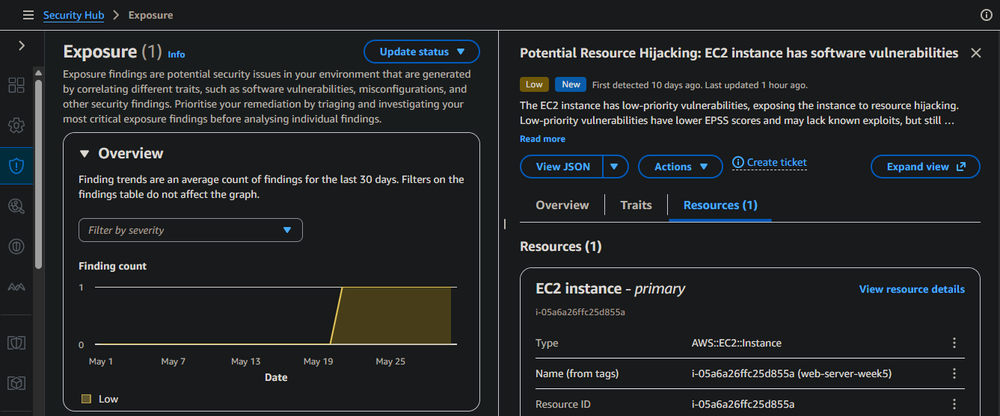
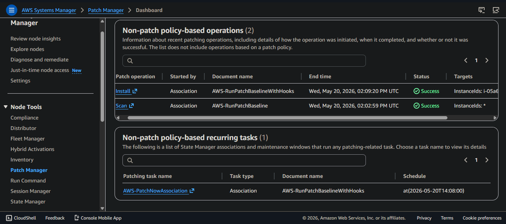

# GuardDuty-SecurityHub-Inspector-ThreatDetection

> Deploying Amazon GuardDuty, AWS Security Hub, and Amazon Inspector for autonomous threat detection, unified security posture management, and vulnerability scanning — with a professional IR runbook as the primary deliverable. Built as part of a hands-on cloud security engineering roadmap.

---

## Overview

Weeks 1–7 of this roadmap built the infrastructure and logging foundation: VPCs, IAM hardening, EC2 hardening, S3 security controls, and CloudTrail-based detection pipelines. Week 8 is where that foundation starts actively defending itself.

This project deploys three complementary AWS security services that form the intelligence and visibility layer of any mature cloud security posture — and documents the incident response procedure for one of the most common and high-severity GuardDuty findings: unauthorized S3 access from a malicious IP address.

---

## Services Deployed

### Amazon GuardDuty — Autonomous Threat Detection

GuardDuty continuously analyses three data sources across the AWS account — CloudTrail management events, VPC Flow Logs, and DNS logs — cross-referencing against AWS threat intelligence feeds and machine learning behavioural models to detect malicious activity automatically.

**Key distinctions:**
- Detects threats you didn't think to write rules for — ML-based behavioural baselining rather than static rule sets
- Consumes CloudTrail as an input — does not replace it
- Generates structured findings with severity scoring, affected resource, actor details, and evidence
- Regional service — enabled per region

**Finding naming convention:** `ThreatPurpose:ResourceType/ThreatFamilyName`

Examples explored during this lab:

| Finding Type | Severity | What It Means |
|---|---|---|
| `UnauthorizedAccess:S3/MaliciousIPCaller` | HIGH | S3 API call from a known malicious IP or Tor exit node |
| `UnauthorizedAccess:IAMUser/TorIPCaller` | MEDIUM | IAM API call originating from a Tor exit node |
| `CryptoCurrency:EC2/BitcoinTool.B` | HIGH | EC2 instance communicating with a cryptocurrency mining pool |
| `Exfiltration:S3/MaliciousIPCaller` | HIGH | Data exfiltration attempt against S3 from malicious infrastructure |

**Sample findings** were generated to explore GuardDuty's full detection catalogue — 389 finding types covering IAM, EC2, S3, EKS, RDS, Lambda, and runtime threats.



---

### AWS Security Hub — Unified Security Posture

Security Hub aggregates findings from GuardDuty, Inspector, IAM Access Analyzer, and other AWS security services into a single dashboard, and continuously evaluates account configuration against industry security frameworks.

**Security standards evaluated:**
- CIS AWS Foundations Benchmark
- AWS Foundational Security Best Practices (FSBP)
- PCI DSS

**Live finding detected:** Security Hub surfaced a real exposure finding within minutes of Inspector being enabled:

```
Type:     Exposure/Potential Impact/Resource Hijacking
Resource: AWS::EC2::Instance i-05a6a26ffc25d855a (web-server-week5)
Severity: LOW
Finding:  EC2 instance has software vulnerabilities exposing it to resource hijacking
```

Security Hub correlated two Inspector inputs — unpatched kernel CVEs and internet-reachable ports 80/443 — into a single exposure finding. This demonstrates the aggregation and correlation value Security Hub provides beyond individual service dashboards.



**Findings workflow statuses:** New → Notified → Suppressed → Resolved

---

### Amazon Inspector — Automated Vulnerability Scanning

Inspector continuously scans EC2 instances and ECR container images for known CVEs, outdated packages, and unintended network exposure — providing pre-attack vulnerability intelligence before an attacker can exploit weaknesses.

**Live scan results on web-server-week5:**

Inspector detected multiple kernel-level CVEs and a python3-pip-wheel vulnerability within minutes of being enabled. The network reachability analysis confirmed ports 80 and 443 were reachable from an Internet Gateway — elevating the finding severity by combining software vulnerability with network exposure.

**Remediation performed:** AWS Systems Manager Patch Manager was used to patch the instance — `Scan and Install` operation scoped specifically to `i-05a6a26ffc25d855a`. Patches applied, instance rebooted, kernel CVEs resolved. Inspector findings updated on next scan cycle.



**Inspector vs GuardDuty distinction:**

| | Inspector | GuardDuty |
|---|---|---|
| **Question answered** | What could be exploited? | What is being exploited right now? |
| **Timing** | Pre-attack — proactive | During/after attack — reactive |
| **Analogy** | Vulnerability scanner (Nessus) | SIEM + threat intelligence (Wazuh + feeds) |

---

## How the Three Services Work Together

```
BEFORE ATTACK          DURING/AFTER ATTACK     ALWAYS-ON POSTURE
─────────────          ───────────────────     ─────────────────
Inspector              GuardDuty               Security Hub
Finds the CVE          Detects the exploit     Aggregates both
on your EC2            attempt in real-time    + compliance checks
      │                       │                       │
      └───────────────────────┴───────────────────────┘
                              │
                        Security Hub
                   (single pane of glass)
                              │
                         You respond
                       (IR Runbook ↓)
```

**CloudTrail remains the forensic foundation.** GuardDuty consumes CloudTrail — it does not replace it. When GuardDuty fires a finding, CloudTrail provides the complete forensic record: every API call, every resource accessed, every action taken — in sequence. GuardDuty tells you something happened. CloudTrail tells you exactly what happened.

---

## Primary Deliverable — IR Runbook

**Finding covered:** `UnauthorizedAccess:S3/MaliciousIPCaller`

**Scenario:** GuardDuty detects an IAM user's credentials being used to access an S3 bucket from a known malicious IP address — specifically a Tor exit node. Credentials have been compromised. Scope unknown. Response required immediately.

**Severity:** HIGH — CVSS-aligned Base Score 8.1 (AV:N/AC:L/PR:L/UI:N/S:U/C:H/I:H/A:N)

The runbook covers nine sections:

| Section | Content |
|---|---|
| 1 — Incident Overview | Finding summary, CVSS alignment, threat actor objectives, likely attack chain |
| 2 — Detection | Alert sources, GuardDuty finding fields to extract immediately, error code interpretation |
| 3 — Preserve | GuardDuty finding export, CloudTrail log validation, S3 access log preservation, EBS snapshot |
| 4 — Contain | Disable compromised access key, revoke active sessions, restrict S3 bucket, block malicious IP |
| 5 — Investigate | CloudWatch Log Insights queries, blast radius assessment, lateral movement detection, initial access vector analysis |
| 6 — Remediate | Delete compromised key, issue new credentials, harden S3 bucket, harden IAM posture, update GuardDuty threat intel |
| 7 — Recover | Verification checklist, finding resolution, legitimate access restoration |
| 8 — Post-Incident Documentation | IR report structure, MTTD/MTTR/MTTC/MTTE metrics |
| 9 — Severity & Escalation Matrix | Severity tiers, response SLAs, notification paths, response posture |

📄 [IR Runbook PDF](screenshots/IR_Runbook_UnauthorizedAccess_S3_MaliciousIPCaller.pdf)

**Core IR sequencing enforced throughout:**
```
Preserve → Contain → Investigate → Remediate → Recover → Document
```

---

## Key Conceptual Anchors

- GuardDuty consumes CloudTrail — it does not replace it. Disabling CloudTrail partially blinds GuardDuty
- A GuardDuty finding with a blank error code means the API call **succeeded** — treat as confirmed incident, not attempt
- Inspector lag is expected — use Patch Manager compliance view for real-time patch status, not Inspector findings
- Security Hub findings persist after remediation until Inspector's next scan cycle closes them — this is normal
- GuardDuty is regional — enable it in every region, including inactive ones. Attackers deliberately target unmonitored regions
- Runtime Monitoring requires SSM agent on running instances — additional cost consideration for lab environments

---

## AWS Services Used

- **Amazon GuardDuty** — Autonomous threat detection across CloudTrail, VPC Flow Logs, and DNS logs
- **AWS Security Hub** — Unified finding aggregation and compliance posture management
- **Amazon Inspector** — Automated CVE scanning and network reachability analysis
- **AWS Systems Manager Patch Manager** — Controlled, auditable patch operations on EC2 instances
- **AWS CloudTrail** — Forensic ground truth — all API call activity
- **Amazon CloudWatch Logs** — Log ingestion and querying via Log Insights

---

## Part of the AWS Cloud Security Roadmap

This project is Week 8 of a structured 6-month AWS Cloud Security Engineering program.

| Week | Topic | Deliverable |
|---|---|---|
| 1 | Cloud Foundations, Shared Responsibility | [Cloud-Foundations-Shared-Responsibility-Model](https://github.com/Atlas-Ghostshell/Cloud-Foundations-Shared-Responsibility-Model) |
| 2 | VPC & Networking | [VPC-Networking-Fundamentals](https://github.com/Atlas-Ghostshell/VPC-Networking-Fundamentals) |
| 3 | IAM Deep Dive | [IAM-Least-Privilege-S3-Access-Control](https://github.com/Atlas-Ghostshell/IAM-Least-Privilege-S3-Access-Control) |
| 4 | Cloud Storage & S3 | [S3-Static-Website-Versioning-Data-Protection](https://github.com/Atlas-Ghostshell/S3-Static-Website-Versioning-Data-Protection) |
| 5 | EC2 Hardening & IMDSv2 | [Hardened-EC2-Web-Server](https://github.com/Atlas-Ghostshell/Hardened-EC2-Web-Server) |
| 6 | VPC Deep Dive — 3-Tier Architecture | [Secure-3-Tier-VPC-Architecture](https://github.com/Atlas-Ghostshell/Secure-3-Tier-VPC-Architecture) |
| 7 | CloudTrail, CloudWatch, Root Detection | [CloudTrail-CloudWatch-Root-Detection](https://github.com/Atlas-Ghostshell/CloudTrail-CloudWatch-Root-Detection) |
| **8** | **GuardDuty, Security Hub, Inspector** | **This repository** |
| 9 | IAM Attacks & Network Hardening | Coming soon |

---

*Geoffrey Muriuki Mwangi · [GitHub: Atlas-Ghostshell](https://github.com/Atlas-Ghostshell) · [LinkedIn](https://linkedin.com/in/geoffrey-muriuki-b4ba71306)*
